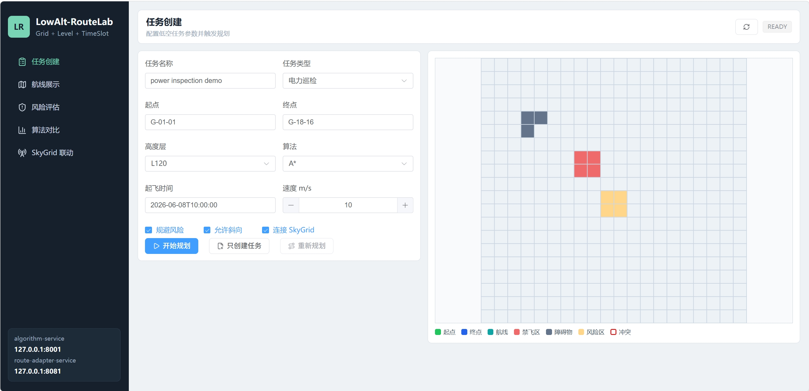
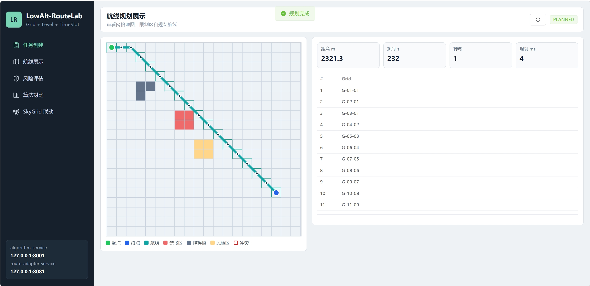
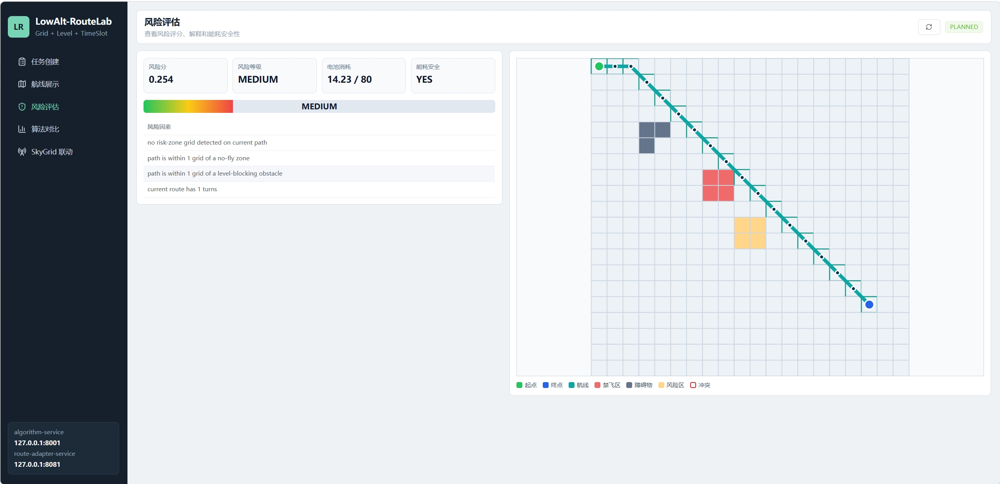
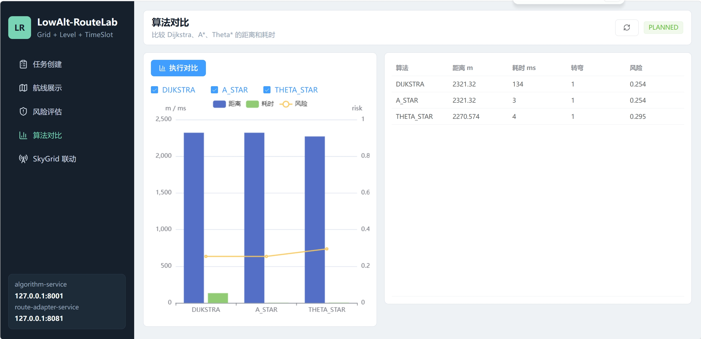
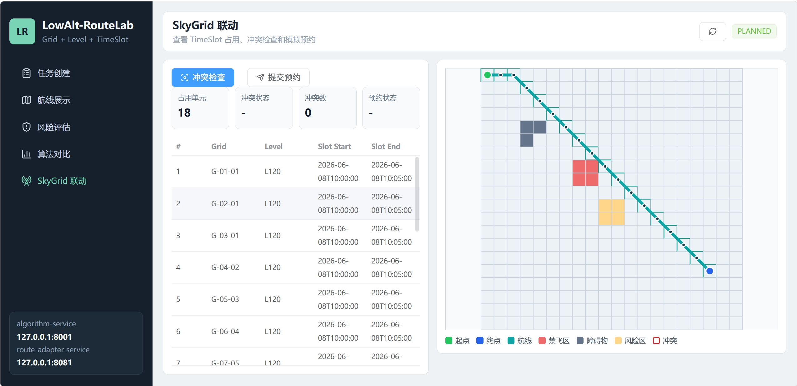
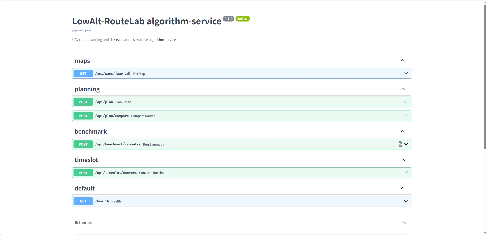

# LowAlt-RouteLab

城市低空无人机航迹规划与风险评估仿真系统。

英文名：

```text
LowAlt-RouteLab: UAV Route Planning and Risk Evaluation Simulator for Urban Low-Altitude Airspace
```

LowAlt-RouteLab 将城市低空空域建模为：

```text
Grid + Level + TimeSlot
```

系统支持低空网格地图、禁飞区、障碍物、风险区、Dijkstra / A* / Theta* 路径规划、C8 转弯代价、D4 对称增强实验、风险评分、能耗估计、TimeSlot 占用转换和 SkyGrid mock 冲突校验。

## 低空项目群闭环

LowAlt-RouteLab 负责低空航线规划与风险评估，SkyGrid 负责低空空域资源调度与冲突治理。两个项目组合后，不再是两个孤立 demo，而是形成“从航线生成到空域审批治理”的工程闭环。

```text
LowAlt-RouteLab
航线规划 / 风险评估 / 能耗估计 / TimeSlot 转换
        ↓
SkyGrid
空域预约 / 审批流转 / 冲突检测 / 占用记录 / 消息通知 / 监控治理
```

闭环链路：

```text
航线规划 → 风险评估 → TimeSlot 占用转换 → SkyGrid 冲突检测 → 预约审批 → 通知审计 → 监控治理
```

## 项目定位

本项目不是普通后台管理系统，而是面向低空技术与工程方向的算法仿真项目。

它解决的问题是：

```text
给定无人机任务起点、终点、高度层和任务类型，
在禁飞区、障碍物、风险区和离散时间片约束下，
生成可解释、可评估、可提交空域资源系统的航线。
```

## 架构

```text
frontend
  ↓
route-adapter-service
  ↓
algorithm-service
  ↓
demo map / benchmark tasks

route-adapter-service
  ↓
MockSkyGridClient
```

服务说明：

- `algorithm-service`：Python FastAPI 算法服务。
- `route-adapter-service`：Java Spring Boot 适配服务。
- `frontend`：Vue 3 低空航线规划工作台。

详细说明见：

- [架构说明](docs/architecture.md)
- [API 设计](docs/api-design.md)
- [算法设计](docs/algorithm-design.md)
- [项目边界](docs/project-boundary.md)
- [群论增强模块](docs/group-theory-module.md)
- [实验计划](docs/experiment-plan.md)
- [复试项目介绍](docs/interview-notes.md)

## 与 SkyGrid 的关系

SkyGrid 负责：

- 空域资源管理
- 预约审批
- 冲突检测
- 通知审计

LowAlt-RouteLab 负责：

- 航线生成
- 风险评估
- 能耗估计
- TimeSlot 占用转换
- 调用 SkyGrid 检查和提交

当前项目用 `MockSkyGridClient` 模拟真实 SkyGrid，保证没有外部系统时也能完整演示。接入真实 SkyGrid 时，LowAlt-RouteLab 输出的占用序列会作为 SkyGrid 冲突检测和预约审批的输入。

## 核心功能

- 20x20 demo 城市低空地图。
- 高度层：`L60`、`L90`、`L120`、`L150`、`L180`。
- 禁飞区、障碍物、风险区建模。
- Dijkstra / A* / Theta* 航线规划。
- C8 离散航向群计算转弯代价。
- D4 二面体群做网格旋转/反射和任务增强实验。
- 风险评分和风险解释。
- 简化能耗估计。
- 路径转 TimeSlot 占用序列。
- Java 适配服务串联任务、规划、占用和 SkyGrid mock。
- Vue 前端展示任务、地图、航线、风险、算法对比和 SkyGrid 联动。

## 技术栈

```text
Python 3.10+ / FastAPI / Pydantic / pytest
Java 17 / Spring Boot 3 / Maven / JUnit
Vue 3 / Vite / TypeScript / Element Plus / ECharts / SVG
Docker Compose
```

## 快速启动

可参考 `.env.example` 中的默认端口和服务地址。当前本地启动默认使用：

```text
algorithm-service: http://127.0.0.1:8001
route-adapter-service: http://127.0.0.1:8081
frontend: http://127.0.0.1:5173
```

### 方式一：本地启动

推荐使用启动脚本：

```powershell
.\scripts\start-dev.ps1
```

双击启动方式：

```text
start-lowalt-routelab.bat
```

如果 PowerShell 阻止脚本运行，先执行：

```powershell
Set-ExecutionPolicy -Scope Process -ExecutionPolicy Bypass
```

停止本地开发服务：

```powershell
.\scripts\stop-dev.ps1
```

双击停止方式：

```text
stop-lowalt-routelab.bat
```

也可以手动启动三个服务：

启动 Python 算法服务：

```bash
cd algorithm-service
pip install -r requirements.txt
uvicorn app.main:app --reload --port 8001
```

启动 Java 适配服务：

```bash
cd route-adapter-service
mvn spring-boot:run
```

启动前端：

```bash
cd frontend
npm install
npm run dev
```

访问：

```text
http://127.0.0.1:5173/
```

### 方式二：Docker Compose

```bash
docker compose up --build
```

访问：

```text
http://127.0.0.1:5173/
```

## API 示例

### 路径规划

```bash
curl -X POST http://127.0.0.1:8001/api/plan \
  -H "Content-Type: application/json" \
  -d "{\"mapId\":\"demo-city-20x20\",\"taskType\":\"POWER_LINE_INSPECTION\",\"startGrid\":\"G-01-01\",\"endGrid\":\"G-18-16\",\"level\":\"L120\",\"algorithm\":\"A_STAR\",\"avoidRisk\":true,\"allowDiagonal\":true}"
```

### 算法对比

```bash
curl -X POST http://127.0.0.1:8001/api/plan/compare \
  -H "Content-Type: application/json" \
  -d "{\"mapId\":\"demo-city-20x20\",\"startGrid\":\"G-01-01\",\"endGrid\":\"G-18-16\",\"level\":\"L120\",\"algorithms\":[\"DIJKSTRA\",\"A_STAR\",\"THETA_STAR\"]}"
```

### TimeSlot 转换

```bash
curl -X POST http://127.0.0.1:8001/api/timeslot/convert \
  -H "Content-Type: application/json" \
  -d "{\"path\":[\"G-01-01\",\"G-01-02\",\"G-02-03\"],\"level\":\"L120\",\"startTime\":\"2026-06-08 10:00:00\",\"speed\":10.0,\"gridSizeMeters\":100,\"slotMinutes\":5}"
```

### 创建 Java 任务并规划

```bash
curl -X POST http://127.0.0.1:8081/api/tasks \
  -H "Content-Type: application/json" \
  -d "{\"taskName\":\"demo task\",\"taskType\":\"POWER_LINE_INSPECTION\",\"startGrid\":\"G-01-01\",\"endGrid\":\"G-18-16\",\"startLevel\":\"L120\",\"startTime\":\"2026-06-08T10:00:00\",\"algorithm\":\"A_STAR\"}"
```

```bash
curl -X POST http://127.0.0.1:8081/api/tasks/1/plan
```

```bash
curl -X POST http://127.0.0.1:8081/api/tasks/1/check-conflict
```

## 前端演示流程

1. 打开 `http://127.0.0.1:5173/`。
2. 在任务创建页配置起点、终点、高度层、算法和任务类型。
3. 点击开始规划。
4. 在航线展示页查看网格地图、禁飞区、障碍物、风险区和航线。
5. 在风险评估页查看 `riskScore`、`riskLevel`、`riskFactors` 和能耗安全性。
6. 在算法对比页运行 Dijkstra / A* / Theta*。
7. 在 SkyGrid 联动页查看 TimeSlot 占用，执行 mock 冲突检查和 mock 提交。

## 演示截图

### 任务创建



### 航线规划展示



### 风险评估



### 算法对比



### SkyGrid 联动



### API 文档



## 测试命令

Python：

```bash
cd algorithm-service
pytest -q
```

Java：

```bash
cd route-adapter-service
mvn test
```

前端构建：

```bash
cd frontend
npm run build
```

## 当前实现状态

已完成：

- `algorithm-service` 可独立启动。
- `/health` 正常。
- `demo-city-20x20` 地图可加载。
- `/api/plan` 支持 Dijkstra / A* / Theta*。
- 路径能避开禁飞区和障碍物。
- C8 转弯代价已接入搜索代价。
- D4 对称变换和 benchmark 可运行。
- 风险评分、风险解释和能耗估计已返回。
- 路径可转换为 TimeSlot 占用序列。
- `route-adapter-service` 可创建任务、调用 Python、检查 mock 冲突。
- 前端可展示网格、航线、风险、算法对比和 SkyGrid 联动。
- Docker Compose 文件已提供。

后续可扩展：

- Java 侧接 MySQL 持久化。
- 实现 `RealSkyGridClient`。
- 支持高度层切换和爬升代价。
- 增加任务历史和地图编辑能力。

## 复试项目介绍

可以这样介绍：

```text
我围绕低空技术与工程方向做了两个互补项目。SkyGrid 负责低空空域资源的预约、审批、冲突检测和微服务治理；LowAlt-RouteLab 负责低空无人机航线规划和风险评估。LowAlt-RouteLab 将低空环境建模为 Grid + Level + TimeSlot，支持禁飞区、障碍物、风险区和已有占用约束下的 Dijkstra / A* / Theta* 路径规划，并引入 C8 离散航向群计算转弯代价、D4 二面体群进行网格对称变换和测试增强。系统最终能把规划路径转换为 SkyGrid 可识别的占用时间片，完成从航线生成到预约审批和冲突检测的完整闭环。
```
